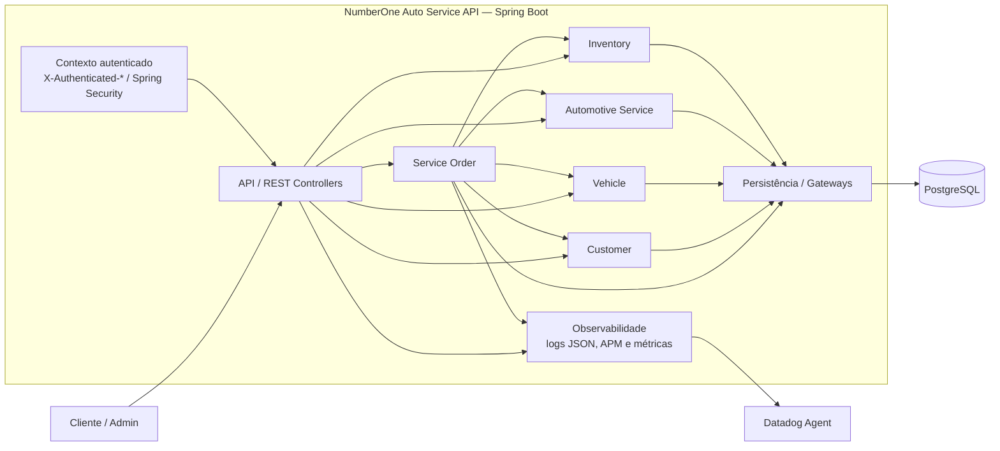

# Diagrama de Componentes — NumberOne Auto Service API

## Objetivo

Apresentar os principais componentes da Auto Service API e suas dependências, sem detalhar classes. A aplicação recebe o contexto autenticado confiável pelos headers `X-Authenticated-*`; login e emissão de JWT não são responsabilidades deste componente.

Os módulos usam gateways e adaptadores de persistência para acessar o PostgreSQL. A observabilidade inclui métricas Micrometer/DogStatsD, logs estruturados e traces enviados ao Datadog Agent.
