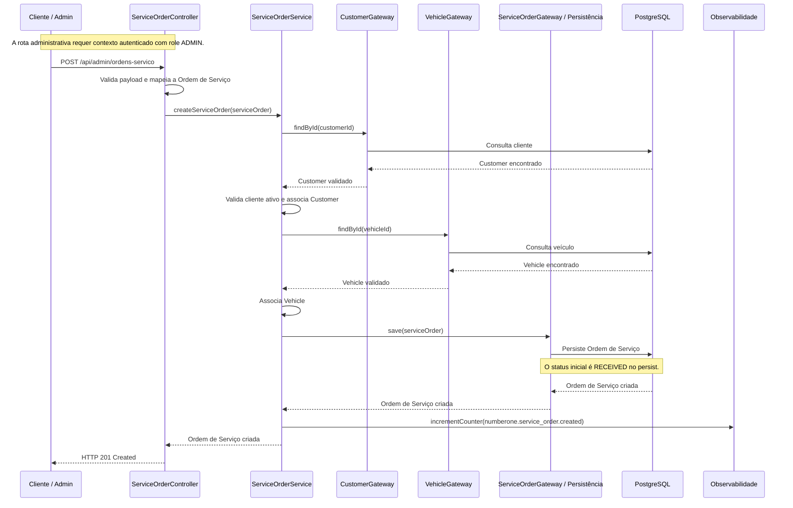

# Sequência — Abertura de Ordem de Serviço

## Objetivo

Registrar o fluxo arquitetural real de criação de Ordem de Serviço pelo endpoint `POST /api/admin/ordens-servico`.

```mermaid
sequenceDiagram
    participant Admin as Cliente / Admin
    participant Controller as ServiceOrderController
    participant Service as ServiceOrderService
    participant Customer as CustomerGateway
    participant Vehicle as VehicleGateway
    participant Order as ServiceOrderGateway / Persistência
    participant Database as PostgreSQL
    participant Metrics as Observabilidade

    Note over Admin,Controller: A rota administrativa requer contexto autenticado com role ADMIN.
    Admin->>Controller: POST /api/admin/ordens-servico
    Controller->>Controller: Valida payload e mapeia a Ordem de Serviço
    Controller->>Service: createServiceOrder(serviceOrder)

    Service->>Customer: findById(customerId)
    Customer->>Database: Consulta cliente
    Database-->>Customer: Customer encontrado
    Customer-->>Service: Customer validado
    Service->>Service: Valida cliente ativo e associa Customer

    Service->>Vehicle: findById(vehicleId)
    Vehicle->>Database: Consulta veículo
    Database-->>Vehicle: Vehicle encontrado
    Vehicle-->>Service: Vehicle validado
    Service->>Service: Associa Vehicle

    Service->>Order: save(serviceOrder)
    Order->>Database: Persiste Ordem de Serviço
    Note over Order,Database: O status inicial é RECEIVED no persist.
    Database-->>Order: Ordem de Serviço criada
    Order-->>Service: Ordem de Serviço criada

    Service->>Metrics: incrementCounter(numberone.service_order.created)
    Service-->>Controller: Ordem de Serviço criada
    Controller-->>Admin: HTTP 201 Created
```
